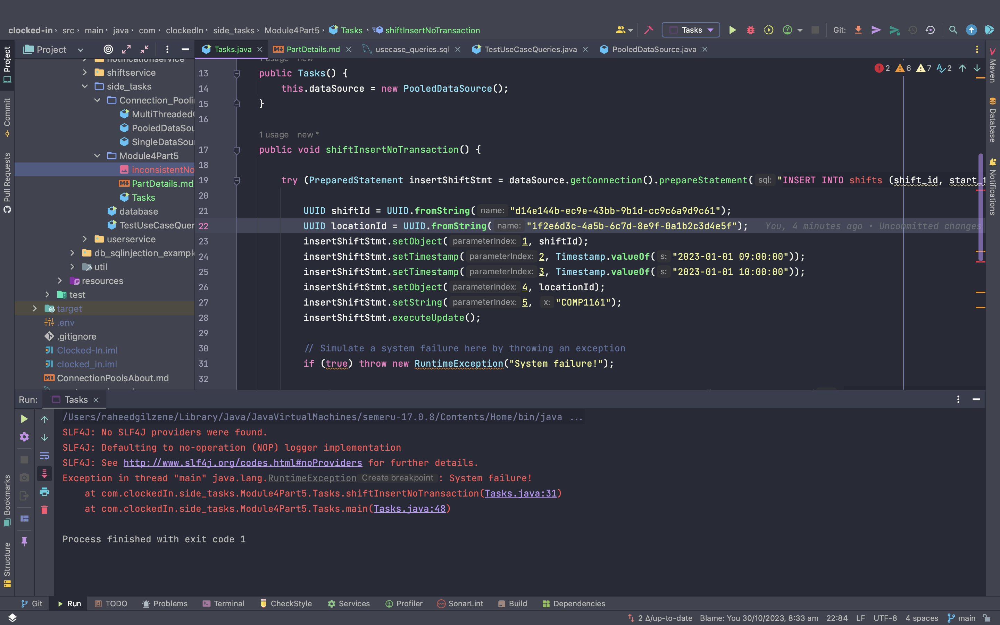
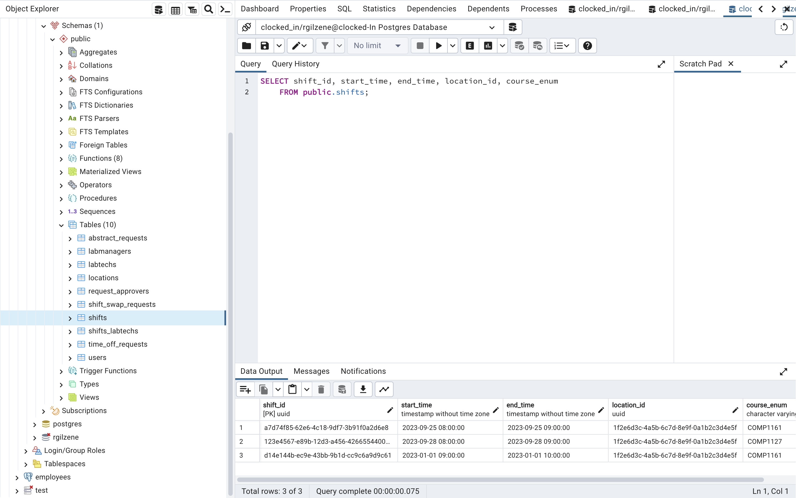
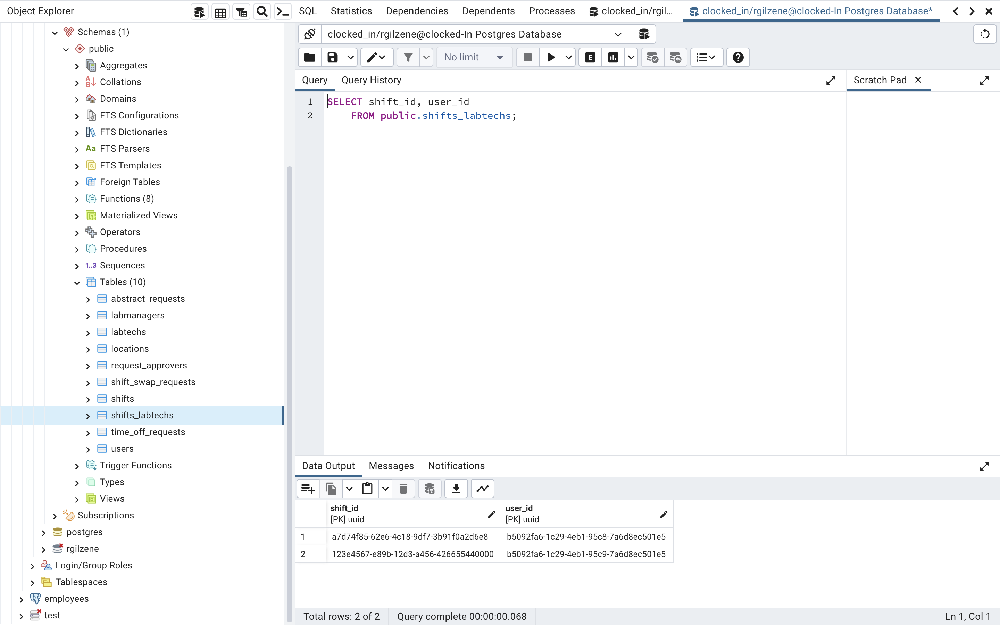
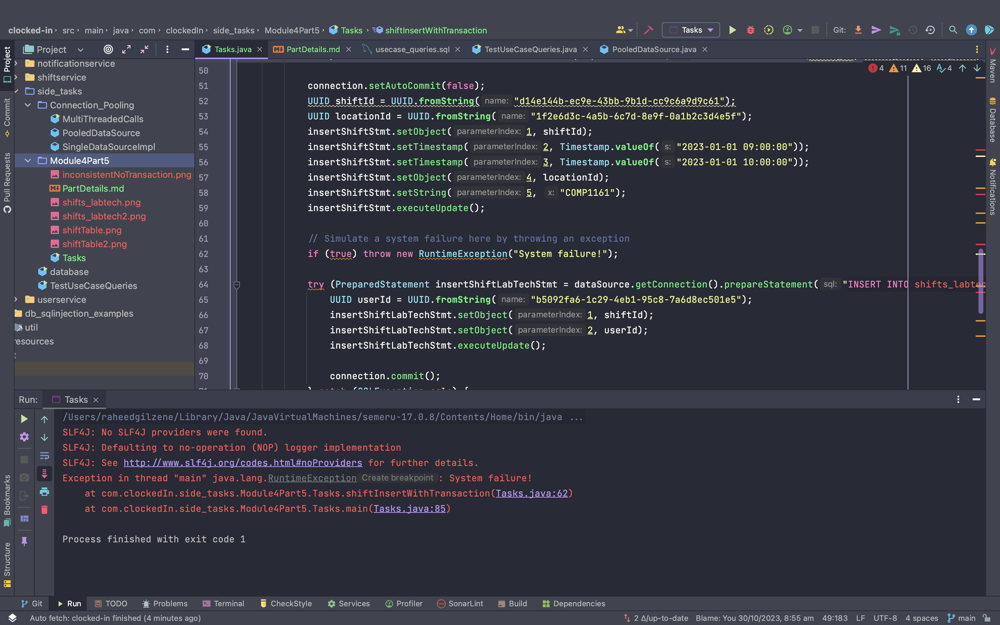
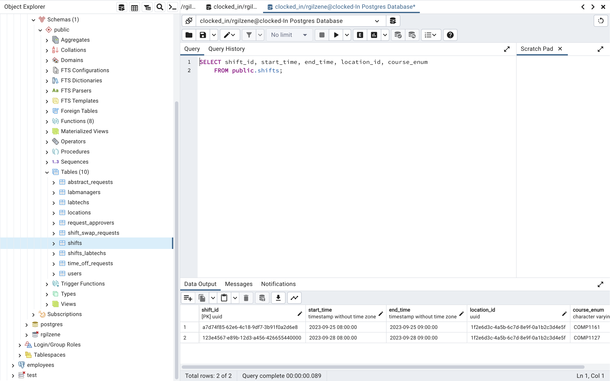
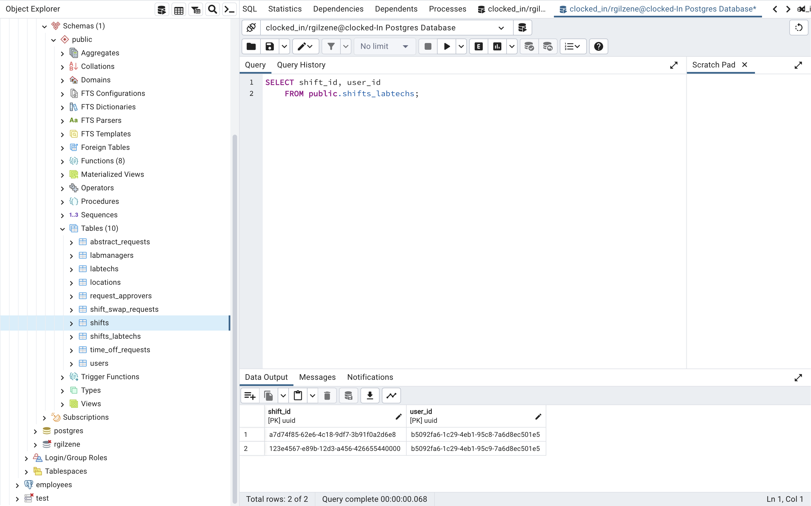

# Part 1 - Inconsistent Database

# Inconsistency Without Transactions
As seen in the screenshot below, one of two PreparedStatements were ran before
a RuntimeException was generated. This should put the clockedIn database in an inconsistent
state as once a shift is created and inserted, labtechs must be assigned to it.

An error was generated before the labtech for the shift was inserted.


As described above, let's check the database for the `shifts` table to ensure it is inconsistent.
### shifts table

Shift was inserted as seen as the record at the bottom. Now let's check the `shifts_labtechs` table.

### shifts_labtech table
As you can see, that second query was never done, so now the `shifts_labtech` table does not have the new shift and the database is inconsistent.


# Inconsistency With Transactions

Now let's try to run the same query with transactions.

Same set of queries as before but this time autocommit has been turned off and 
commit will only happen when the labtech shift insert occurs.

If there is an error then rollback will happen in the catch statement 
This simulates a transaction.


As expected, the `shifts` table does not have the new record.


The `shifts_labtechs` table also does not have the new record.


Transaction enables consistency by ensuring that commits will not happen unless all changes have been made.

# Part 2 - Isolation Levels

As it pertains to the clockedIn database, there are a few cases where 
the default isolation level may not be enough.
Almost all of these cases have to do with Requests and how they are approved.

Let's say there is a case where LabTech A sends out a shiftSwapRequest
and LabTech B and LabTech C sees it and decides that they both want to do
a swap. Then when LabTech B and LabTech C approves the request, there may be a case 
where the system does not accept the actual LabTech that clicks first. 
Hence, an isolation of Serializable may be needed.

## How Demonstration Is Done
For this demonstration, we have four Labtechs trying to approve a single shiftSwapRequest
all at once. This is achieved using threading to allow concurrently approving the request
and also a Cyclic Barrier to make simulate the action happening at the same time.

With the default isolation level, if the first Labtech is currently approving the request, then another Labtech
could possibly make an edit as well while they are doing their transaction.

But with the serializable isolation level, once the first Labtech locks the record, he will be able to approve or deny a 
request with no problem or interruption.

# Part 3
For this section where it is required that a couple million records be 
inserted into the database, a simple for loop is used to insert dummy records into 
the `users` table.


``` java
PreparedStatement pstmt = conn.prepareStatement("INSERT INTO users(user_id, university_id, first_name, last_name, user_role, phone_num, email) VALUES (?, ?, ?, ?, ?, ?, ?)");
    for (int i = 0; i < 2000000; i++) {
        pstmt.setObject(1, UUID.randomUUID());
        pstmt.setString(2, Integer.toString(i));
        pstmt.setString(3, "FirstName" + i);
        pstmt.setString(4, "LastName" + i);
        pstmt.setString(5, "Role" + i);
        pstmt.setString(6, "Phone" + i);
        pstmt.setString(7, "Email" + i);
        pstmt.addBatch();
        if (i % 1000 == 0) {
            pstmt.executeBatch();
        }
    }
    pstmt.executeBatch();
```

After this, four queries are executed to time the actual query to find a record 
by university_id. A query with the index and one without the index is run plus the explain analyze query.

``` java
// Delete index
stmt.execute("DROP INDEX IF EXISTS idx_university_id");
// Query without index
ResultSet rs = stmt.executeQuery("EXPLAIN ANALYZE SELECT * FROM users WHERE university_id = '1000043'");
while (rs.next()) {
    System.out.println(rs.getString(1));
}
long start = System.currentTimeMillis();
rs = stmt.executeQuery("SELECT * FROM users WHERE university_id = '1000043'");
System.out.println("--------------------------------------------------");
System.out.println("Time taken without index: " + (System.currentTimeMillis() - start));

// Create index
stmt.execute("CREATE INDEX idx_university_id ON users(university_id)");
System.out.println("--------------------------------------------------");
// Query with index
rs = stmt.executeQuery("EXPLAIN ANALYZE SELECT * FROM users WHERE university_id = '1000067'");
while (rs.next()) {
    System.out.println(rs.getString(1));
}System.out.println("--------------------------------------------------");
start = System.currentTimeMillis();
rs = stmt.executeQuery("SELECT * FROM users WHERE university_id = '1000067'");
System.out.println("Time taken with index: " + (System.currentTimeMillis() - start));
```

### Below are the results of the query without the index created

```
Gather  (cost=1000.00..129071.79 rows=1 width=89) (actual time=3793.858..3810.423 rows=1 loops=1)
  Workers Planned: 2
  Workers Launched: 2
  ->  Parallel Seq Scan on users  (cost=0.00..128071.69 rows=1 width=89) (actual time=3611.410..3756.629 rows=0 loops=3)
        Filter: ((university_id)::text = '1000043'::text)
        Rows Removed by Filter: 666668
Planning Time: 0.943 ms
JIT:
  Functions: 6
  Options: Inlining false, Optimization false, Expressions true, Deforming true
  Timing: Generation 2.093 ms, Inlining 0.000 ms, Optimization 1.246 ms, Emission 21.886 ms, Total 25.225 ms
Execution Time: 3864.538 ms
--------------------------------------------------
Time taken without index: 343
```
As we can see, without the index a concurrent scan is done on the database using two workers 
to try and find the entry. Expected execution time is 3864.538 ms but the java time which was 
recorded is 343 ms.

### Below are the results of the query with the index created

```
--------------------------------------------------
Index Scan using idx_university_id on users  (cost=0.43..8.45 rows=1 width=89) (actual time=2.471..2.473 rows=1 loops=1)
  Index Cond: ((university_id)::text = '1000067'::text)
Planning Time: 0.398 ms
Execution Time: 2.521 ms
--------------------------------------------------
Time taken with index: 3
```

Just a simple index scan is done and is much faster than using concurrency. 
Execution time was said to be 2.521 ms compared to no index 3864.538 ms. 
Java code recorded the time taken to be 3 ms vs the 343 ms for the concurrent scan.


# Part 4
As it relates to a use case for clockedIn database, there will be scenarios 
where we will need to do a lookup of a user's email by using their Unversity ID 
for various reasons. Creating a compound index on both these fields would enable faster 
lookup for other fields as well. It will also be faster if a single field of the index is 
used for lookups as well, in some scenarios.

```
Index Scan using idx_universityid_email on users  (cost=0.43..8.45 rows=1 width=89) (actual time=2.847..2.849 rows=1 loops=1)
  Index Cond: (((university_id)::text = '1955563'::text) AND ((email)::text = 'Email1955563'::text))
Planning Time: 3.041 ms
Execution Time: 2.895 ms
--------------------------------------------------
Time taken with both columns: 3
--------------------------------------------------
Index Scan using idx_universityid_email on users  (cost=0.43..54548.47 rows=1 width=89) (actual time=2563.570..3226.225 rows=1 loops=1)
  Index Cond: ((email)::text = 'Email1955565'::text)
Planning Time: 0.073 ms
Execution Time: 3226.254 ms
--------------------------------------------------
Time taken with one column: 67
```

As seem, index scan is done for both fields and also kicks in for a single field `email` 
of the compound index.


